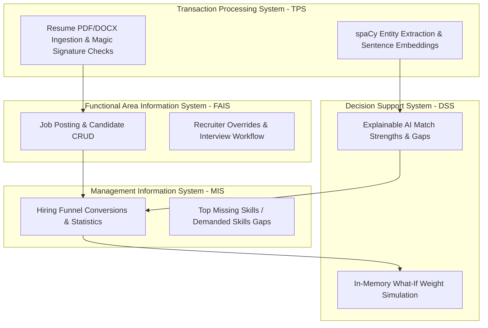

# TalentLens-AI — AI-Powered HR Recruitment MIS Portal

TalentLens-AI is an enterprise-style Management Information System (MIS) designed for automated resume parsing, semantic matching, explainable scoring, and recruiter decision support. It bridges automated natural language processing (NLP) pipelines with human-in-the-loop oversight, full operational audit trailing, and secure data hosting.

---

## 1. System Architecture & MIS Concept Mappings

This application maps directly to the four core layers of enterprise Information Systems taught in Management Information Systems (MIS) curriculums:



### 1. Transaction Processing System (TPS)
* **Ingestion and Validation Transactions**: Reads raw unstructured resume files (`.pdf`, `.docx`, `.txt`), enforces structured binary signature checks (magic numbers validation) to block malicious files disguised as text/PDF documents, and caps file size limits at 10MB.
* **Extraction Transactions**: spaCy parses structural elements (contact information, educations, experiences, projects, and certifications).
* **Text Sanitization**: Raw resumes are run through regular expression blockages to redact protected characteristics (gender, age, marital status, religion, caste) before they reach matching engines, implementing the Privacy-by-Design principle.

### 2. Functional Area Information System (FAIS) — Human Resource Management (HRM)
* **Job Requisition Management**: Recruiter-facing portal to define required/preferred skills, target thresholds, and scoring weight distributions.
* **Hiring Workflow Tracking**: Recruiter reviews candidate profiles, schedules interviews, marks records as shortlisted/held/rejected, and leaves notes.
* **Permanent Compliance Audit Logs**: Captures every state-mutating transaction (user login, job created, resume uploaded, score changes, candidates deleted, candidate identity revealed in blind mode) in a structured audit log database.

### 3. Management Information System (MIS)
* **Aggregate Dashboards**: Tracks high-level indicators like total candidates cataloged, shortlisted/rejection rates, and average processing times.
* **Recruitment Funnel**: Visualizes conversion funnel steps (`Applications ➔ Screened ➔ Shortlisted ➔ Interviewed ➔ Selected`).
* **Operational Reporting**: Identifies the **most common missing skills** (candidate qualification gaps) and **most in-demand skills** across position requisitions, allowing managers to adjust job specifications or educational pipelines.
* **Reporting Exports**: Allows recruiters to download structured CSV reports containing fit scores, rankings, and decision details.

### 4. Decision Support System (DSS)
* **In-Memory What-If Simulation Engine**: Allows recruiters to dynamically slide weight distributions or toggle skills between "Required" and "Preferred" on the fly, immediately displaying candidate rank shifts and score fluctuations without writing any data to the database.
* **Explainable AI Matrix**: Breaks down candidate profiles into clear, structured strengths, gaps, missing skills, and overall match confidence (High/Medium/Low) based on exact keyword matches vs inferred semantic matching.
* **Blind Mode Masking**: Allows recruiters to toggle "Blind Mode" at the job level. Candidate identities, locations, and contact info are fully anonymized to remove unconscious bias during the screening phase, until a recruiter submits a logged justification reason to reveal the applicant's real identity.

---

## 2. Installation & Local Execution

### Backend Setup (FastAPI & SQLite)

1. **Python Environment**:
   ```powershell
   cd backend
   python -m venv .venv
   .venv\Scripts\activate
   pip install -r requirements.txt
   ```
2. **Download NLP Spacy Model**:
   ```powershell
   python -m spacy download en_core_web_sm
   ```
3. **Seed Database**:
   Wipes local `talentlens.db` and populates 3 users, 2 jobs, and 5 candidates with structured profile scores.
   ```powershell
   python seed.py
   ```
4. **Start Dev Server**:
   ```powershell
   python -m uvicorn main:app --port 8000
   ```

### Frontend Setup (React & Vite)

1. **Dependency Installation**:
   ```powershell
   cd frontend
   npm install
   ```
2. **Start Dev Server**:
   ```powershell
   npm run dev
   ```
   Open `http://localhost:5173` in your browser.

---

## 3. Pre-Seeded Demo Accounts

The database comes pre-seeded with sample users and resumes for evaluation:

* **Administrator Account**:
  * **Email**: `admin@talentlens.ai`
  * **Password**: `password123`
  * **Access**: Full administration rights, candidate profile deletions, and system audit logs view.
* **Recruiter Account**:
  * **Email**: `recruiter@talentlens.ai`
  * **Password**: `password123`
  * **Access**: Resume uploading, What-If simulation engine, and hiring decisions.
